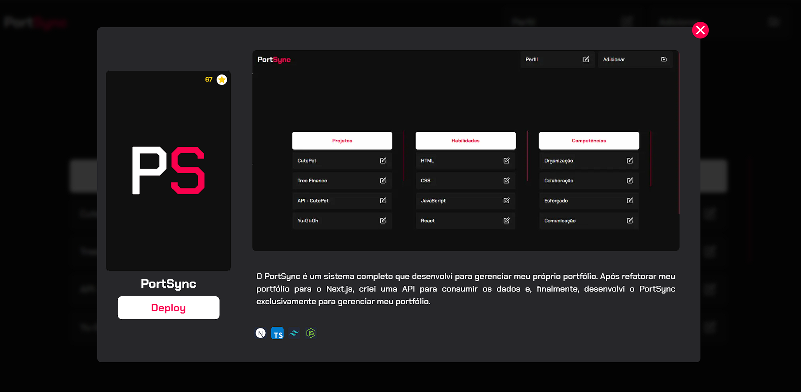

</h1>
   
<h1>Zustand - Favoritos</h1> 

## Descrição

### Neste projeto, estou estudando o [Zustand](https://zustand-demo.pmnd.rs/) para gerenciar o estado global relacionado aos meus projetos, implementando a função de favoritar. Utilizo o [Zustand](https://zustand-demo.pmnd.rs/) para criar uma store customizada chamada `useFavoriteStore`, onde implemento as ações de adicionar e remover projetos favoritos. Além disso, integro ícones de favoritos nos cards dos projetos para melhorar a experiência do usuário. Também aproveito o Next.js para implementar rotas dinâmicas, permitindo a criação de páginas exclusivas para cada projeto. Com Zustand e Next.js, posso criar uma aplicação web responsiva com gerenciamento eficiente de estado e conteúdo dinâmico.

[Ver Projeto](https://zustand-favorites.vercel.app/)

#

## Layout web

#

 

## 🛠️ Tecnologias

💻 **Front-end**
- [Next.js 13.4](https://nextjs.org)
- [Typescript](https://www.typescriptlang.org)

📚 **Bibliotecas**
- [zustand](https://zustand-demo.pmnd.rs/)
- [react-icons](https://react-icons.github.io/react-icons/)

🎨 **Estilização**
- [tailwindcss](https://tailwindcss.com/docs/installation)

🔋 **Versionamento e Deploy**
- [Git](https://git-scm.com)
- [Vercel](https://vercel.com/)

 

⚙️ **Configuranções e Instalações**

Clone do Projeto

    $ git clone https://github.com/renovatt/zustand-favorites.git
Instalando as dependências

    $ npm install

Iniciando o projeto

    $ npm run dev

 

**Como contribuir?**

- Você pode dar suporte me seguindo aqui no GitHub
- Dando uma estrela no projeto
- Criar uma conexão comigo no linkedin fazendo parte da minha networking e curtir o meu projeto.

 

**Autor**
[Wildemberg Renovato de Lima](https://www.linkedin.com/in/renovatt/)